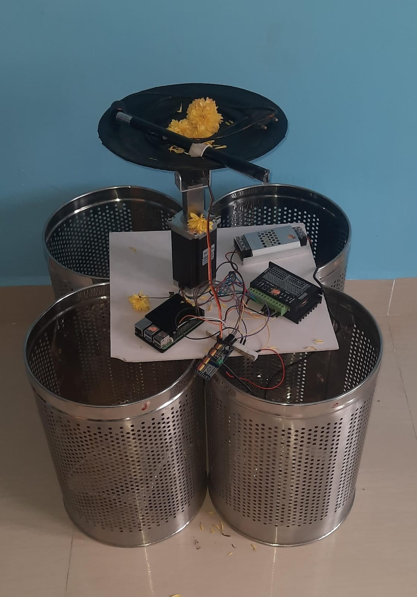

#  AI Waste Sorter  

An **AI-powered smart bin system** that uses **YOLOv8 and Google Gemini** for real-time waste classification and sorting.  
The system integrates **computer vision, generative AI, IoT hardware control, and Firebase cloud services** to automate sustainable waste disposal.  

---

## 🚀 Features  

- 🧠 **AI Classification** – Real-time waste detection using YOLOv8 and Google Gemini API.  
- 🎛️ **Smart Bin Control** – Servo + stepper motors (via PCA9685 + GPIO) to route waste to the correct bin.  
- 🖥️ **Interactive Dashboard** – PyQt5 GUI with live camera feed, instructional videos, and classification results.  
- ☁️ **Firebase Integration** – Monitor bin levels remotely.  
- 🌍 **Sustainability Tracking** – CO₂ savings, recycling rates, material breakdown.  
- 🔔 **Feedback System** – User-friendly classification results with alerts and sustainability messages.  

---

## 📂 Project Structure  

```
AI-Waste-Sorter/
│
├── Checking.py              # Hardware control (Servo + Stepper)
├── sxauto5.py               # Main PyQt5 + YOLO + Firebase Application
│
├── requirements.txt         # Python dependencies
├── README.md                # Documentation
├── .gitignore               # Ignore cache, env files, large data
│
├── images/                  # UI assets & videos
│   ├── Sortyx_intro_video.mp4
│   ├── SortyxVideo.mp4
│   ├── general_trash.png
│   ├── sharps_waste.png
│   ├── biohazardous_waste.png
│   ├── chemical_waste.png
│   └── Sortyx_logo.png
│
├── models/                  # Pre-trained models
│   ├── yolov8n.pt
│   ├── best.pt
│
├── classified_results/      # Saved classified images + metadata
└── .env.example             # Example environment variables
```

---

## 🛠️ Hardware Requirements  

- **Raspberry Pi 4/5** (or equivalent SBC with GPIO)  
- **ESP32/MCU** (optional for IoT extensions)  
- **PCA9685 PWM Controller**  
- **Servo Motor (MG995 / SG90)**  
- **Stepper Motor (NEMA 17 / NEMA 23) + Driver (TB6600/A4988)**  
- **12V Relay (for actuator control)**  
- **Camera (USB/Webcam or Pi Camera)**  
- **Dustbin compartments (General, Sharps, Biohazard, Chemical)**  

---

## ⚙️ Software Requirements  

- Python 3.9+  
- OpenCV, Ultralytics YOLOv8, PyQt5  
- Firebase Realtime Database (configured in `.env`)  
- Google Gemini API key (for classification + reasoning)  

---

## 📦 Installation  

1. Clone this repository:  
   ```bash
   git clone https://github.com/your-username/AI-Waste-Sorter.git
   cd AI-Waste-Sorter
   ```

2. Create a virtual environment (recommended):  
   ```bash
   python3 -m venv venv
   source venv/bin/activate   # On Linux/Mac
   venv\Scripts\activate      # On Windows
   ```

3. Install dependencies:  
   ```bash
   pip install -r requirements.txt
   ```

4. Configure environment variables:  
   - Copy `.env.example` → `.env`  
   - Add your Firebase DB URL and Google Gemini API key:  

   ```env
   GEMINI_API_KEY=your_gemini_key
   FIREBASE_DATABASE_URL=https://your-firebase-db.firebaseio.com/
   ```

---

## ▶️ Running the Application  

```bash
python sxauto5.py
```

- The app starts with an **intro video**, then switches to the **instructional video**.  
- When an object is detected via camera, it switches to **classification mode**.  
- Based on results, it **routes waste to the correct bin**.  

---

## 📊 Example Workflow  

1. Place an object in front of the camera.  
2. YOLOv8 detects the object → Gemini validates classification.  
3. Object is classified into one of:  
   - General Trash (Black Bin)  
   - Sharps Waste (Blue Bin)  
   - Biohazardous Waste (Yellow Bin)  
   - Chemical Waste (Red Bin)  
4. Hardware moves servo/stepper to route the item.  
5. Sustainability stats update in **Firebase** + GUI dashboard.  

---

## 📈 Sustainability Metrics  

The system calculates:  
- Total items processed  
- Recycling rate (%)  
- CO₂ saved (kg)  
- Equivalent trees planted  
- Breakdown by material (plastic, paper, glass, metal, e-waste, organic, others)  

---

## 📷 Screenshots



---

## 🤝 Contributing  

1. Fork the repo  
2. Create a new branch: `git checkout -b feature-name`  
3. Commit changes: `git commit -m "Add new feature"`  
4. Push branch: `git push origin feature-name`  
5. Create a Pull Request  

---

## 📜 License  

This project is licensed under the **MIT License** – feel free to use, modify, and share with attribution.  
